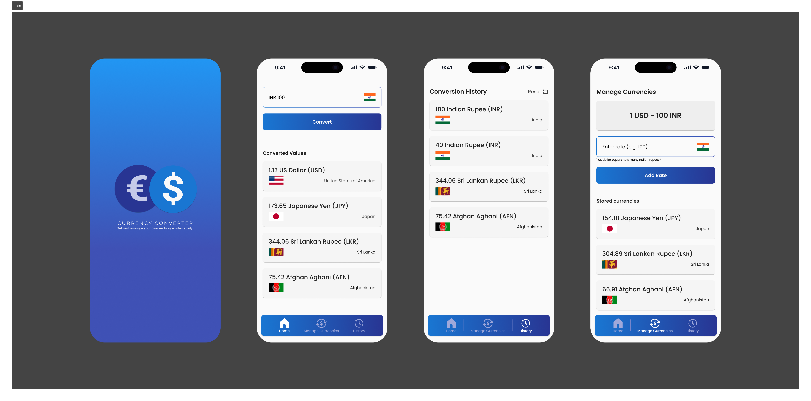

# Getting Started

> **Note**: Make sure you have completed the [Set Up Your Environment](https://reactnative.dev/docs/set-up-your-environment) guide before proceeding.

## Figma Design



## Project Directory Structure

```plaintext
CurrencyConverter/
├── android/                # Android native code
├── ios/                    # iOS native code
├── assets/                 # Custom fonts and design assets
├── src/                    # Application source code
│   ├── common/             # Common utilities, types and layouts
│   ├── components/         # Reusable UI components
│   ├── contexts/           # React Context providers
│   ├── i18n/               # Internationalization files
│   ├── navigation/         # Navigation configuration
│   ├── screens/            # Application screens
│   ├── App.tsx             # Main application entry point
│   └── type.d.ts           # Global type declarations
├── .gitignore              # Git ignore file
├── package.json            # Project dependencies and scripts
├── tsconfig.json           # TypeScript configuration
└── README.md               # Project documentation
```

## Running Your App

### Step 1: Install Dependencies

Make sure you have [Yarn](https://yarnpkg.com/getting-started/install) installed on your machine.

First, install the project dependencies using Yarn. From the root of your React Native project, run:

```sh
yarn install
```

### Step 2: Start Metro Builder

First, you will need to run **Metro**, the JavaScript build tool for React Native.

To start the Metro dev server, run the following command from the root of your React Native project:

```sh
yarn start
```

### Step 3: Build and run your app

With Metro running, open a new terminal window/pane from the root of your React Native project, and use one of the following commands to build and run your Android or iOS app:

For Android:

```sh
yarn android
```

For iOS, remember to install CocoaPods dependencies (this only needs to be run on first clone or after updating native deps).

```sh
yarn pod && yarn ios
```

If everything is set up correctly, you should see your new app running in the Android Emulator, iOS Simulator, or your connected device.

This is one way to run your app — you can also build it directly from Android Studio or Xcode.

*Congratulations! You now have a React Native app running on your device! You can start editing the code in `App.tsx` to begin customizing your app.*

## Assumptions

1. The project has three main screens: Home, Manage Rates and History.
2. The user is expected to first set the desired currency rates in the Manage Rates screen before performing any conversions.
3. Next, the user can perform currency conversions on the Home screen.
4. The app maintains a history of all conversions performed by the user, which can be viewed on the History screen.
5. Swipe left to delete a currency rates from the Manage Rates screen.
